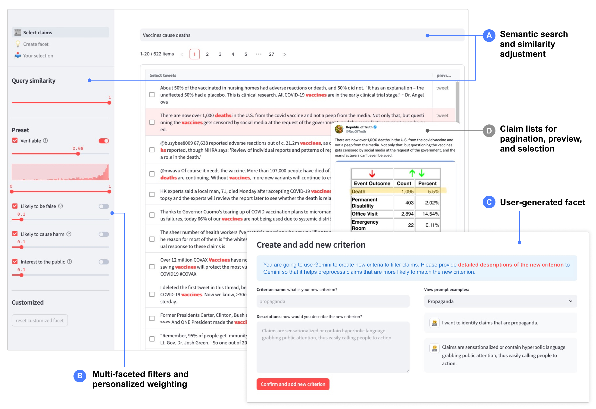

# Claim Prioritization Prototype

A tool for fact-checkers and journalists to efficiently identify and prioritize checkworthy social media claims using AI-powered criteria.



## Overview

This application was developed by [the AI and Human-Centered Computing Group](https://ai.ischool.utexas.edu/) at the University of Texas at Austin. It explores how fact-checkers and journalists can use different claim criteria to prioritize checkworthy content for fact-checking.

The prototype uses three AI models to analyze, rank, and filter hundreds or thousands of social media claims based on various criteria, including verifiability, potential falsehood, public interest, and potential for harm.

## Quick Start

```bash
# Set up environment
conda create -n checkworthiness python=3.9
conda activate checkworthiness

# Install dependencies
pip install -r requirements.txt

# Run the application
streamlit run 👋Introduction.py
```

Make sure to create an .env and store your API key

## Features

#### 1. Weighted Ranking

Personalize the importance of different claim criteria to rank all claims. Claims that match your prioritized criteria will appear at the top of the list.

- Adjust weights for built-in criteria like verifiability, potential falsehood, public interest, and harm
- Tweak the ranking algorithm to match your specific fact-checking priorities
- See immediate results as you adjust the weights

#### 2. Faceted Searching

Filter claims based on specific criteria to focus on the most relevant content.

- Toggle criteria on/off to include or exclude claims
- Select probability ranges to filter
- Visualize the distribution of claims across probability ranges

#### 3. User-customized Criteria

Create your own personalized criteria beyond the default options using natural language descriptions.

- Define new criteria in plain language (e.g., "propaganda," "urgent," "difficult to check")
- Leverage GPT to analyze all claims against your custom criteria
- Add your custom criteria to the ranking and filtering system

#### 4. Claim Selection and Export

Select and save claims of interest for further investigation.

## Citation

```
@ARTICLE{Houjiang2024-sm,
  title         = "Exploring Multidimensional Checkworthiness: Designing
                   {AI}-assisted Claim Prioritization for Human Fact-checkers",
  author        = "Liu, Houjiang and Gwizdka, Jacek and Lease, Matthew",
  journal       = "arXiv [cs.HC]",
  month         =  dec,
  year          =  2024,
  archivePrefix = "arXiv",
  primaryClass  = "cs.HC",
  arxivid        = "2412.08185",
  note          = "To appear at CSCW 2025"
}
```